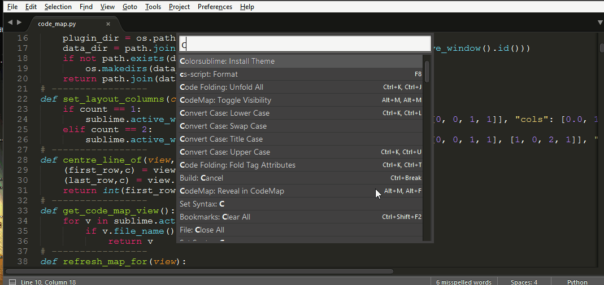

# Sublime CodeMap

A plugin for displaying the code map (code structure tree) in the [Sublime Text 3](http://sublimetext.com "Sublime Text") editor.

This plugin is a port of [PyMap](https://marketplace.visualstudio.com/items?itemName=OlegShilo.PyMap) Visual Studio extension.

Plugin currently supports building the code tree for Python. Support for C# is in the pipeline. The design of plugin allows integration of the user defined _tree building_ algorithm for other languages. The _custom syntax_ integration infrastructure and and samples will  be available in the next release.

<!-- MarkdownTOC -->

- [Installation](#installation)
- [Usage](#usage)
- [Command Palette](#command-palette)
- [Custom mapping](#custom-mapping)
    - [Universal Mapper](#universal-mapper)
    - [Map depth](#map-depth)
- [Navigation with Keyboard](#navigation-with-keyboard)
- [Settings](#settings)

<!-- /MarkdownTOC -->


<a name="installation"></a>
## Installation

Note the plugin was developed and tested against ST3 but not ST2.

*__Package Control__*

You can install the pluging [Package Control](https://packagecontrol.io/packages/CodeMap).

*__Manual__*

* Remove the package, if installed, using Package Control.
* Add a repository: `https://github.com/oleg-shilo/sublime-codemap.git`
* Install `sublime-codemap` with Package Control.
* Restart Sublime editor if required

You can also install the plugin by cloning `sublime-codemap` repository into your Packages folder or manually placing the download package there.

<a name="usage"></a>
## Usage
The plugin uses a dedicated view group __Code - Map__ (on right side) to mimic a "side bar" with the content (code tree) that represents code structure of the active view content in the primary view group.

The code tree automatically refreshes on saving the active document or switching the tabs. The usage is quite simple. You can double-click a node in the code tree and this will trigger navigation to the corresponding area in the code (in active document). Alternatively you can synchronize code tree node selection with the current caret position in the document by triggering `sync_code_map` command either from _Command Palette_ or by the configured shortcut.

To start working with CodeMap just make the map view visible (e.g. [alt+m, alt+m]) and set the focus to the code view.



<a name="command-palette"></a>
## Command Palette

Press `cmd+shift+p`. Type `codemap` to see the available commands:

* *__Toggle Visibility__* - Show/Hide CodeMap view.
The CodeMap view is always placed in the most right column (group) of the active window. If `show_in_new_group` is set to `true`, a new group will be created.  
Default keybinding is **`Alt+m  Alt+m`**

* *__Reveal in CodeMap__* - Select code tree node that corresponds the caret position in the code (active view).  
Default keybinding is **`Alt+m  Alt+.`**

* *__Render From View__* - Attempt to render CodeMap from a view that isn't bound to a phisycal file.  
Default keybinding is **`Alt+m  Alt+,`**

<a name="custom-mapping"></a>
## Custom mapping

You can extend the built-in functionality with custom mappers. A Custom Mapper is a Python script, which defines a mandatory `def generate(file)` routine that analyses a given file content and produces a 'code map' representing the content structure.

You can find the [code_map.md.py](custom_mappers/code_map.md.py) sample in the source code. This mapper builds the list of markdown sections in the given text file.
In order to activate the mapper its script needs to be properly named and placed in the special folder: `<Packages>\User\CodeMap\custom_mappers`. The name of the mapper file must follow a special naming convention:
`"code_map.<extension>.py"`

  Example: `"%APPDATA%\Sublime Text 3\Packages\User\CodeMap\custom_mappers\code_map.md.py"`

You can associate a syntax to the custom mapper, so that the CodeMap will use it. Custom syntaxes can also be put in `Packages\User\CodeMap\custom_languages`. The syntax association must be specified in the custom mapper itself.

<a name="universal-mapper"></a>
### Universal Mapper

The _universal mapper_ is a generic Regex based mapper that can be used as an alternative for dedicated custom mappers. The mapping algorithm(s) of the _universal mapper_ is defined in the plugin settings, and is extension-dependent.

The plugin will always try to use _universal mapper_ mapping algorithm first, and only if it's not available the plugin will try to locate a dedicated custom mapper based on the active document file extension. Full instructions on how to make a custom mapper using the _universal mapper_ are included in the settings file.

Note that if you use a custom mapper for an extension that is already defined in the _universal mapper_ settings, the latter will have precedence. Comment out the extension in the _universal mapper_ section to use your custom mapper in its place.

The advantage of using the _universal mapper_ (and define new rules for it when needed) is that it supports by default the map depth system, with which you can alter the depth of the displayed map. Custom mappers need to support this system internally.

Below is a simple example of adding _universal mapper_ support for TypeScript:

Add file extension (e.g. '_ts_') and name of the algorithm section to the `syntaxes` section:
```json
"syntaxes":     [
                        ["universal",   ""],
                        ["text",        "txt"],
                        ["typescript",  "ts"],
                        ["python",      "py"]
                ],
```

Create a new `typescript` section an fill it with the the following content:
```json
"typescript": {
                "regex":
                [
                    [
                        "^(class |function |export class |interface ).*$",
                        "[(:{].*$",
                        "",
                        false
                    ]
                ],
                "indent": 4,
                "obligatory indent": false,
                "empty line in map before": "class",
                "line numbers before": false,
                "prefix": "",
                "suffix": "()",
                "syntax": "Packages/TypeScript/TypeScript.tmLanguage"
             },
```

<a name="map-depth"></a>
### Map depth

If using the _universal mapper_ or a dedicated mapper that supports it, you can change the depth of the displayed map. Default hotkeys are:

    { "keys": ["alt+m", "alt+left"], "command": "code_map_decrease_depth" },
    { "keys": ["alt+m", "alt+right"],"command": "code_map_increase_depth" },


<a name="navigation-with-keyboard"></a>
## Navigation with Keyboard

You can start keyboard navigation with **`Al+m, Alt+n`**. Then use the following keys: 

    up / down                   move by definition
    alt+up / alt+down           move by class
    enter/escape/left/right     focus back on edited view
    
<a name="settings"></a>
## Settings

You can also configure plugin to:
1. Hide the group on closing the CodeMap view when it is the only view in the group.
2. Always place CodeMap view in the individual most-right column.
3. CodeMap group width.
4. Assign a custom font size/font face/margin for the CodeMap.

_code_\__map.sublime-settings_

```js
{
    "close_empty_group_on_closing_map": true,
    "show_in_new_group": true
    "codemap_width": 0.17,
    "codemap_font_size": 8,
    "codemap_font_face": "Verily Serif Mono",
    "codemap_margin": 8,
}
```
